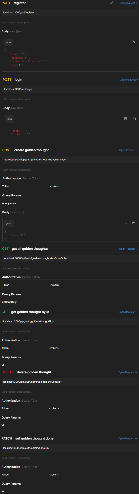

# 7capa7 Rest Api with Node + Typescript
* Application through which we can collect golden thoughts from employees in your company. App allows users to create golden thoughts anonymously or by revealing their name. User can search for all golden thoughts or only those that have not been done yet. Admins can change the status of golden thoughts to 'done' and they can also delete them.

## Requirements
* Nodejs, Npm, Docker

## Quick Start
* To download docker image for postgres: docker pull postgres
* To run docker db container: docker run --name golden_thoughts_app -e POSTGRES_PASSWORD=postgres -e POSTGRES_USER=postgres -e POSTGRES_DB=postgres -p 5432:5432 -d postgres
* Before starting the application, create .env file and complete it based on .env.example file [use https://travistidwell.com/jsencrypt/demo/ to generate SIGNING_SECRET]
* To download required dependencies: npm install
* To run application: npm run dev
* Application by default starts on localhost : 3000
* At the start of the app will be created test users: "user@gmail.pl", "admin@gmail.pl" with password "password"

## Main Technologies
* TypeScript
* Express
* TypeORM
* Postgres
* Jsonwebtoken

